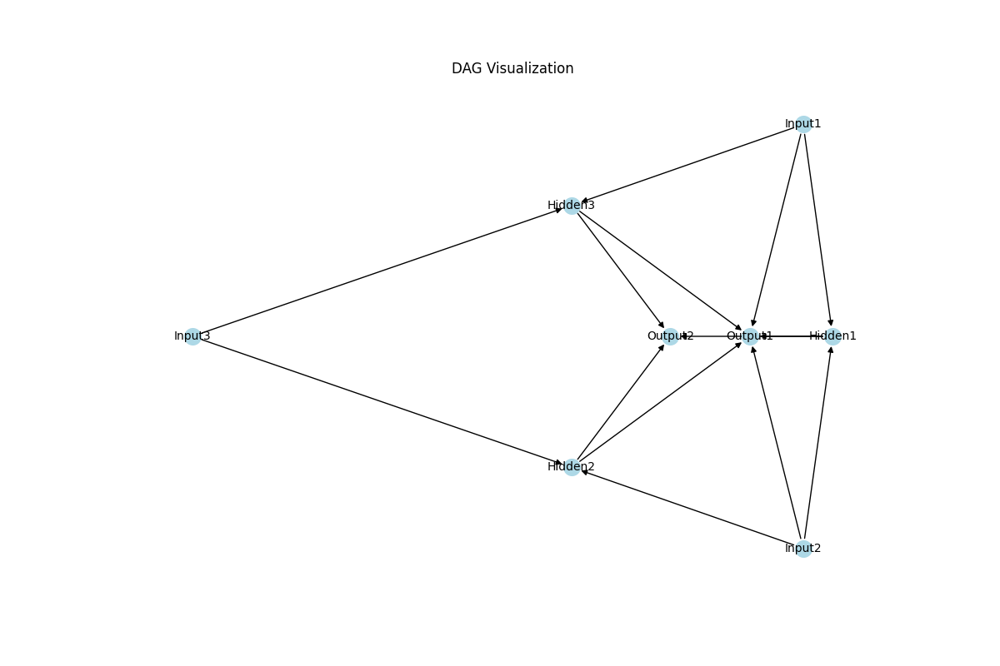

# neuralDAG

Neural network library to play with different network topologies. Solution is based on DAG and topological sort. It is not well-tested, was made for fun. 

## Background

You can create any topology you would like to as long as there are no cycles. It is not recommended to use it for large networks as it is not performant nor optimized. 

## Example:

Here is the topology created with neuralDAG. You can visualize your own topologies using `dag.visualize()`. To see more examples run `test_neuralDAG.py`. It automatically plots examples and you can also see how to work with DAG api. 

